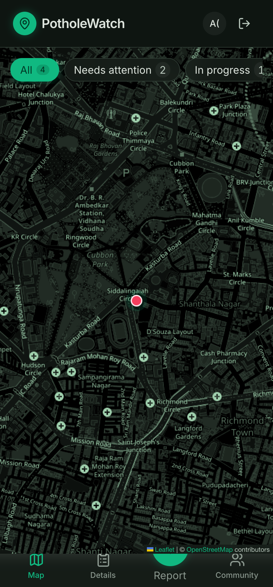
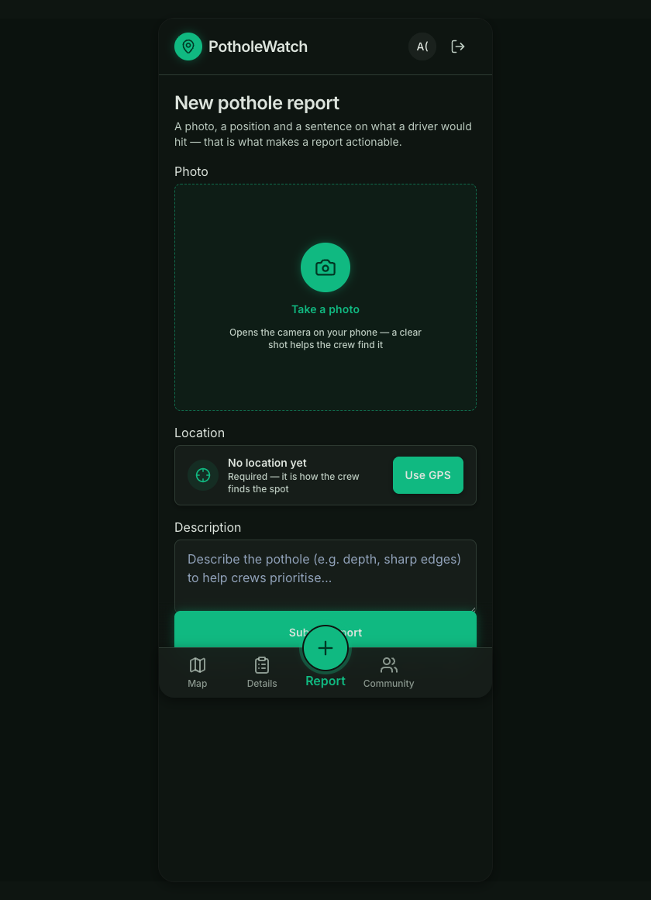
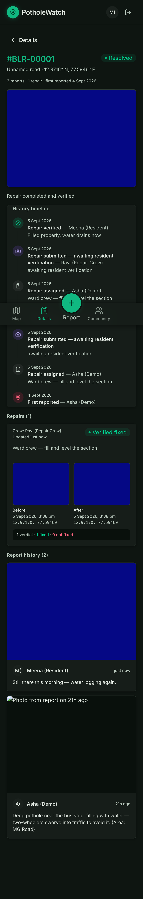

# PotholeWatch 🕳️

**Citizen-powered pothole reporting with proof.** Report a pothole with a photo and GPS, find out someone already did, upvote it instead of duplicating — and make sure every "fixed" claim is verified by a resident before it counts.

> **The core idea:** users create reports; **locations create potholes.** One pothole, many reports, one verified repair — instead of ten identical complaints.

| Map home | Report flow | Pothole history |
|---|---|---|
|  |  |  |

## How it works

1. **Report** — snap a photo (geotagged: GPS is embedded into the image itself), location auto-filled from live GPS, the photo's EXIF tags, or a pin-drop map.
2. **No duplicates** — before submitting, the app checks **20 m** for the same physical pothole (*"Is this the same pothole?"*) and **2 km** for everything already reported nearby. Already reported? **Upvote** it — one tap pushes it up the queue for the municipality.
3. **Repair with evidence** — an assigned repairer must capture **before** and **after** photos *standing at the pothole* (GPS-gated, time-ordered). No on-site evidence, no resolution.
4. **Resident verification** — the repair only counts as fixed when a resident who reported it confirms. "Not fixed" reopens the pothole; the history keeps every repair honest.

Every pothole gets a permanent ID (`#BLR-00001`), a status, report/upvote counts, and a full timeline: *first reported → repaired → reported again → verified*.

## The flow, end to end

```
🟢 CITIZEN (login: "I'm a resident")
   └── Report: photo + GPS + description
         ├── same pothole within 20 m?  → YES, SAME POTHOLE (joins it)
         └── potholes within 2 km?      → upvote the existing one
              🔴 REPORTED
                  │
🟠 ADMIN (login: "I work for the municipality")
   └── Assign repair ──────────┐
                              🟠 IN_PROGRESS
                                  │
🟠 ADMIN (acts as the crew)       │
   └── Start repair               │
       ├── 📸 before photo  (GPS ≤ 25 m of the pothole, required)
       ├── do the fix
       └── 📸 after photo   (GPS ≤ 25 m, must be newer)
              🟣 AWAITING VERIFICATION
                  │
🟢 CITIZEN (a resident who reported it)
   └── "Did this actually get fixed?"
         ├── ✅ Yes, it's fixed  → ✅ RESOLVED  (REPAIRS +1, "Verified by resident")
         └── ❌ No, still broken → 🔴 REOPENED  (back to the queue)

Rules that keep it honest: nobody marks a pothole fixed directly; repair
evidence must be captured on-site (GPS-gated); the crew cannot verify its
own repair; every step lands on the pothole's permanent timeline.
```

## Features

- 🔐 **Google sign-in** only (GIS ID token → httpOnly cookie session) — roles: Citizen, Repairer, Admin (email allowlists)
- 📸 **Geotagged photos** — EXIF GPS embedded on capture; EXIF read + pin-drop picker for gallery uploads
- 🧭 **Duplicate detection** — 20 m same-pothole matching with human confirmation; 2 km area awareness with upvotes
- 🛠️ **Repair verification loop** — GPS-gated before/after evidence, resident sign-off, reopen on failure
- 🗺️ **Map home** — live Leaflet + OpenStreetMap (no API key), status markers, filters, tap-for-details callout
- 🏘️ **Community** — register your community/ward (name, city, state, PIN) and report for it
- 📱 **Installable PWA** — offline app shell via service worker, works as an app on any phone

## Tech stack

| Layer | Tech |
|---|---|
| Frontend | Vite · React 19 · TypeScript · Tailwind CSS v4 · shadcn/ui · React Router 7 · TanStack Query · Leaflet + OpenStreetMap · vite-plugin-pwa |
| Backend | Node · Express 5 · TypeScript · Zod · Prisma · PostgreSQL (Neon) |
| Storage | Cloudflare R2 (S3-compatible, presigned uploads — photos never touch the API server) |
| Auth | Google Identity Services + JWT httpOnly cookie |
| Layout | npm workspaces monorepo with a shared API contract package |

## Project structure

```
├── frontend/   # React PWA (features: map, reports, repairs, potholes, admin, community)
├── backend/    # Express API (routes → controllers → services), Prisma schema + migrations
└── shared/     # Zod schemas + inferred types — the API contract both sides consume
```

## Getting started

**Prerequisites:** Node 20+, a [Neon](https://neon.tech) Postgres database, a [Google OAuth client](https://console.cloud.google.com/apis/credentials) (Web application), and a [Cloudflare R2](https://developers.cloudflare.com/r2/) bucket with an API token.

```bash
# 1. Install
npm install

# 2. Configure environment (fill in your real values)
cp backend/.env.example  backend/.env
cp frontend/.env.example frontend/.env

# 3. Create the database schema
npm run prisma:generate --workspace backend
npx prisma migrate deploy --workspace backend   # or: migrate dev

# 4. Build the shared contract
npm run build --workspace shared

# 5. Run (two terminals)
npm run dev:backend    # Express API on http://localhost:3001
npm run dev:frontend   # Vite app on    http://localhost:5173
```

In Google Cloud Console, add `http://localhost:5173` as an **Authorized JavaScript origin**, and put the client ID in both `backend/.env` (`GOOGLE_CLIENT_ID`) and `frontend/.env` (`VITE_GOOGLE_CLIENT_ID`).

### Key environment variables

| Variable | Purpose |
|---|---|
| `DATABASE_URL` | Neon Postgres connection string |
| `GOOGLE_CLIENT_ID` | OAuth client (frontend + backend) |
| `ADMIN_EMAILS` / `REPAIRER_EMAILS` | Comma-separated allowlists that grant roles at login |
| `R2_*` | Cloudflare account, keys, bucket for photo storage |
| `NEARBY_RADIUS_M` / `REPAIR_GPS_RADIUS_M` / `AREA_RADIUS_M` | Matching thresholds: 20 m same-pothole, 25 m repair evidence, 2 km area sweep |
| `CITY_CODE` | Prefix for pothole IDs (`BLR-00001`) |

## API overview

All routes under `/api`, cookie-authenticated, Zod-validated, errors as `{ error: { message, code } }`.

| Area | Endpoints |
|---|---|
| Auth | `POST /auth/google` · `GET /me` · `POST /auth/logout` |
| Uploads | `POST /uploads/photo` → presigned R2 PUT |
| Potholes | `GET /potholes` · `GET /potholes/:idOrHumanCode` · `GET /potholes/nearby` (20 m) · `GET /potholes/nearby-area` (2 km) · `POST /potholes/:id/repairs` · `PATCH /potholes/:id/status` (admin) · `POST /potholes/:id/upvote` |
| Reports | `POST /reports` · `GET /reports` (mine / all for admin) · `GET /reports/:id/photo` |
| Repairs | `POST /repairs/:id/pickup` · `POST /repairs/:id/before-photo` · `POST /repairs/:id/after-photo` · `POST /repairs/:id/verify` · `GET /repairs/:id/evidence/:stage/photo` |

## Roadmap

- [ ] Severity levels (severe / in-review / fixed) on the map
- [ ] Community-scoped feeds and ward statistics
- [ ] Activity feed + "verify a neighbor's report" nudges
- [ ] Municipal (BBMP) integration and open data export
- [ ] Photo-matching to assist duplicate detection across road segments

---

Built as a civic-tech prototype — photos and locations submitted by users may be shared with municipal works departments.
